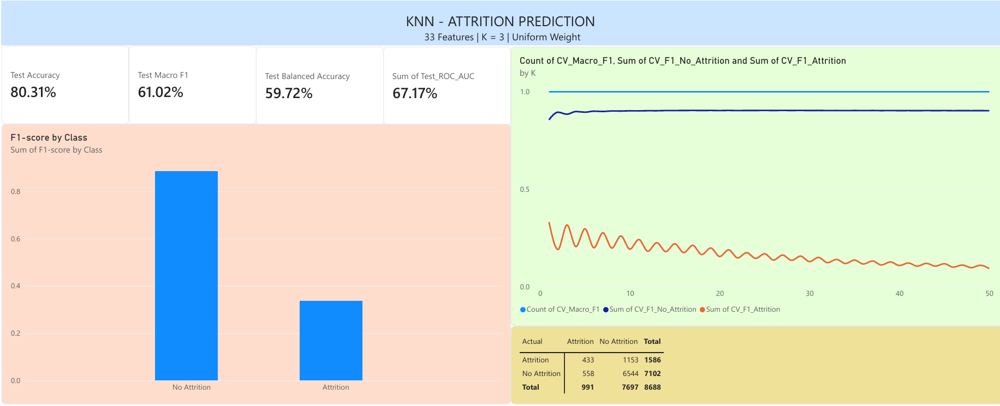

# Employee Attrition Prediction

A group machine learning project that analyzes employee-related factors and develops classification models to predict employee attrition.

> **Project Status:** In Progress
> **Project Type:** Group Machine Learning Project

## Project Overview

This project analyzes employee-related data to explore factors associated with employee attrition and develop machine learning models for predicting whether an employee is likely to leave the organization.

The project includes:

* Data checking and preprocessing
* Exploratory Data Analysis (EDA)
* Data visualization
* K-Nearest Neighbors (KNN)
* Naive Bayes
* Model evaluation
* Power BI visualization

## Dataset

The project uses the **Employee Attrition in the AI & Hybrid-Work Era** dataset from Kaggle.

The original dataset is not included in this repository.

See [`data/README.md`](data/README.md) for more information about the dataset and data source.

## Project Structure

```text
Employee-Attrition-Prediction/
│
├── data/
│   └── README.md
│
├── notebooks/
│   ├── 01_data_checking.ipynb
│   ├── 02_data_visualization.ipynb
│   ├── 03_knn_model.ipynb
│   └── 04_naive_bayes_model.ipynb
│
├── results/
│   ├── knn/
│   └── naive_bayes/
│
├── visualizations/
│   └── powerbi/
│       └── knn_dashboard.png
│
├── README.md
└── requirements.txt
```

## Machine Learning Models

### K-Nearest Neighbors (KNN)

KNN is used to classify employees into:

* `0` = No Attrition
* `1` = Attrition

The K value and model configuration are selected using **5-Fold Stratified Cross-Validation**, with Macro F1 as the main evaluation metric.

The final KNN configuration is:

* **Features:** 33
* **K:** 3
* **Weight:** uniform
* **SMOTE:** Not used
* **CV Macro F1:** 0.6007 ± 0.0057

On the test set, the final KNN model achieved:

* **Accuracy:** 80.31%
* **Macro F1:** 61.02%
* **Balanced Accuracy:** 59.72%
* **ROC-AUC:** 67.17%

Class-specific F1-scores:

* **No Attrition:** 88.44%
* **Attrition:** 33.61%

The model evaluation also includes a confusion matrix to examine the number of correct and incorrect predictions for each class.

### Naive Bayes

Naive Bayes is being developed as another classification model for predicting employee attrition. Its results will be compared with the KNN model using common classification metrics.

## Evaluation

The models are evaluated using:

* Accuracy
* Precision
* Recall
* F1-score
* Macro F1
* Balanced Accuracy
* ROC-AUC
* Confusion Matrix

For the KNN model, **Macro F1** is used as the main metric during cross-validation because the target classes are imbalanced.

In addition to Macro F1, F1-score for each class is examined to evaluate the model's performance on both **No Attrition** and **Attrition** classes.

## Visualization

Power BI is used to visualize the KNN model analysis and evaluation results.

The dashboard includes:

* KNN model configuration
* Model performance metrics
* F1-score by class
* Confusion Matrix
* K selection using 5-Fold Cross-Validation

## Power BI Dashboard

The current Power BI dashboard presents the KNN model analysis and final evaluation results.



## My Contribution

My main responsibility in this project is the **K-Nearest Neighbors (KNN)** component.

My contributions include:

* Preparing and preprocessing data required for KNN classification
* Selecting the K value using 5-Fold Stratified Cross-Validation
* Comparing K values from 1 to 50
* Comparing uniform and distance weighting
* Training and evaluating the final KNN model
* Analyzing model performance using classification metrics
* Creating Power BI visualizations for the KNN analysis

## Tools and Technologies

* Python
* Pandas
* NumPy
* Scikit-learn
* Matplotlib
* Seaborn
* Jupyter Notebook
* Power BI

## Team

This project was developed as a group machine learning project, with different members responsible for different components including data preprocessing, exploratory data analysis, KNN, Naive Bayes, and visualization.

```

### ข้อจำกัดและการใช้งานอย่างมีจริยธรรม

The model identifies patterns and relationships in the dataset but does not establish causal relationships between employee-related factors and attrition.

The model should not be used to make individual employment decisions such as promotion or termination, or to rank individual employees based on predicted attrition risk.

Model predictions should be treated as supporting information for further analysis rather than as definitive outcomes.

**จุดสำคัญที่ผมแก้ให้แล้ว:** `K=48 → K=3`, `SMOTE Used → Not used`, `11 features → 33 features`, metric เป็นผลล่าสุด และเปลี่ยน Power BI จาก 3 รูปเหลือ `knn_dashboard.png` รูปเดียวครับ
```
