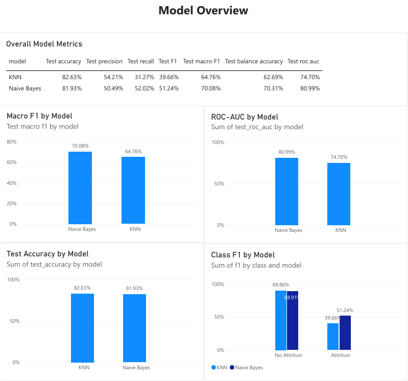
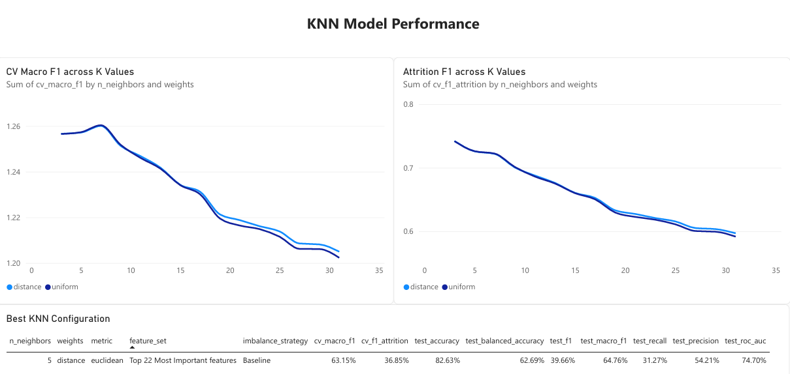
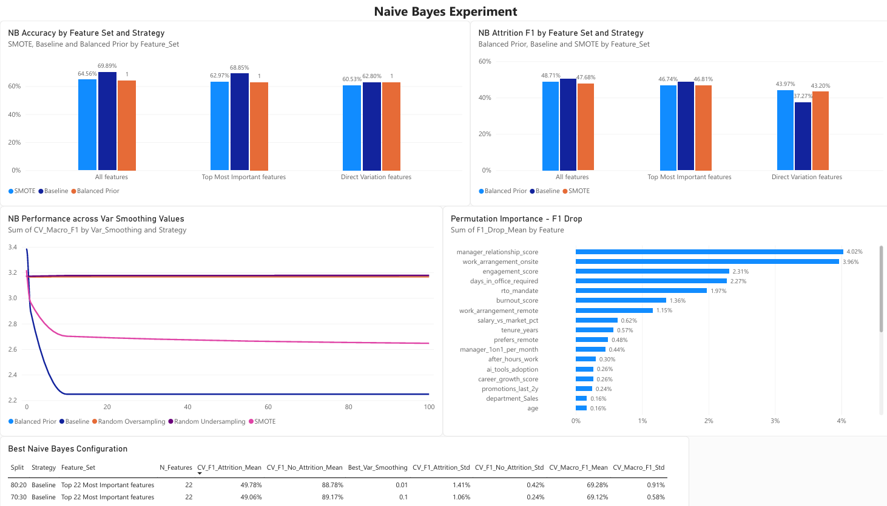
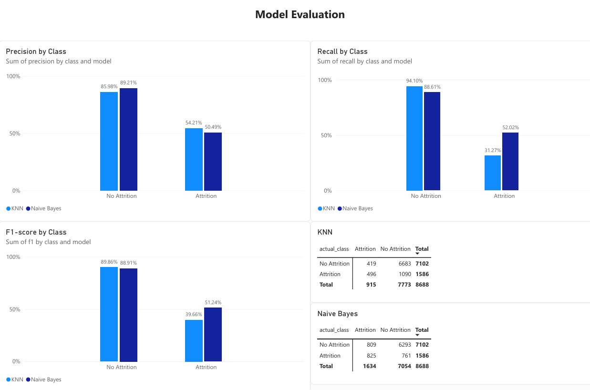
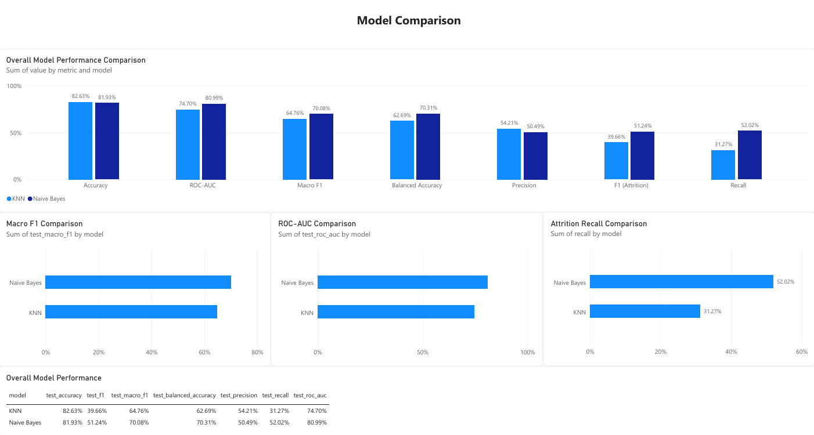

# Employee Attrition Prediction

A group machine learning project that analyzes employee-related factors and develops classification models to predict employee attrition.

> **Project Status:** In Progress
> **Project Type:** Group Machine Learning Project

## Project Overview

This project analyzes employee-related data to explore factors associated with employee attrition and develop machine learning models for predicting whether an employee is likely to leave the organization.

The project includes:

* Data checking and preprocessing
* Exploratory Data Analysis (EDA)
* Data visualization
* K-Nearest Neighbors (KNN)
* Naive Bayes
* Model evaluation
* Power BI visualization

## Dataset

The project uses the **Employee Attrition in the AI & Hybrid-Work Era** dataset from Kaggle.

The original dataset is not included in this repository.

See [`data/README.md`](data/README.md) for more information about the dataset and data source.

## Project Structure

```text
Employee-Attrition-Prediction/
│
├── data/
│   └── README.md
│
├── notebooks/
│   ├── 01_data_checking.ipynb
│   ├── 02_data_visualization.ipynb
│   ├── 03_knn_model.ipynb
│   └── 04_naive_bayes_model.ipynb
│
├── results/
│   ├── knn/
│   └── naive_bayes/
│
├── visualizations/
│   └── powerbi/
│       ├── model_overview.png
│       ├── knn_model_performance.png
│       ├── naive_bayes_experiments.png
│       ├── model_evaluation.png
│       └── model_comparison.png
│
├── README.md
└── requirements.txt
```

## Machine Learning Models

### K-Nearest Neighbors (KNN)

KNN is used to classify employees into:

* `0` = No Attrition
* `1` = Attrition

The K value and model configuration are selected using **5-Fold Stratified Cross-Validation**, with Macro F1 as the main evaluation metric.

The final KNN configuration is:

* **Features:** 33
* **K:** 3
* **Weight:** uniform
* **SMOTE:** Not used
* **CV Macro F1:** 0.6007 ± 0.0057

On the test set, the final KNN model achieved:

* **Accuracy:** 80.31%
* **Macro F1:** 61.02%
* **Balanced Accuracy:** 59.72%
* **ROC-AUC:** 67.17%

Class-specific F1-scores:

* **No Attrition:** 88.44%
* **Attrition:** 33.61%

The model evaluation also includes a confusion matrix to examine the number of correct and incorrect predictions for each class.

### Naive Bayes

Naive Bayes is used as a second classification model for predicting employee attrition.

The Naive Bayes experiments compare different:

* Feature sets
* Class imbalance strategies
* `var_smoothing` values

Model performance is evaluated using common classification metrics, including Macro F1 and F1-score for the Attrition class.

The Naive Bayes results are compared with the KNN model in the final model comparison dashboard.

## Evaluation

The models are evaluated using:

* Accuracy
* Precision
* Recall
* F1-score
* Macro F1
* Balanced Accuracy
* ROC-AUC
* Confusion Matrix

For model selection, **Macro F1** is emphasized because the target classes are imbalanced.

In addition to overall performance, F1-score and Recall for each class are examined to evaluate performance on both **No Attrition** and **Attrition** classes.

## Visualization

Power BI is used to visualize the machine learning experiments, model evaluation, and comparison between KNN and Naive Bayes.

The Power BI dashboard consists of five pages:

### 1. Model Overview

Provides an overview of the dataset, classification problem, and overall model performance.



### 2. KNN Model Performance

Shows KNN performance across different K values and the selected KNN configuration.



### 3. Naive Bayes Experiments

Shows the effects of feature sets, class imbalance strategies, and `var_smoothing` values on Naive Bayes performance, as well as permutation feature importance.



### 4. Model Evaluation

Shows detailed model evaluation using class-level metrics and confusion matrices.



### 5. Model Comparison

Compares the final KNN and Naive Bayes models using common classification metrics.



## My Contribution

My main responsibility in this project is the **K-Nearest Neighbors (KNN)** component.

My contributions include:

* Preparing and preprocessing data required for KNN classification
* Selecting the K value using 5-Fold Stratified Cross-Validation
* Comparing K values from 1 to 50
* Comparing uniform and distance weighting
* Training and evaluating the final KNN model
* Analyzing model performance using classification metrics
* Creating Power BI visualizations for the KNN analysis

## Tools and Technologies

* Python
* Pandas
* NumPy
* Scikit-learn
* Matplotlib
* Seaborn
* Jupyter Notebook
* Power BI

## Team

This project was developed as a group machine learning project, with different members responsible for different components including data preprocessing, exploratory data analysis, KNN, Naive Bayes, and visualization.

## Limitations

The models identify patterns and relationships in the dataset but do not establish causal relationships between employee-related factors and attrition.

The models should not be used to make individual employment decisions such as promotion or termination, or to rank individual employees based on predicted attrition risk.

Model predictions should be treated as supporting information for further analysis rather than as definitive outcomes.
